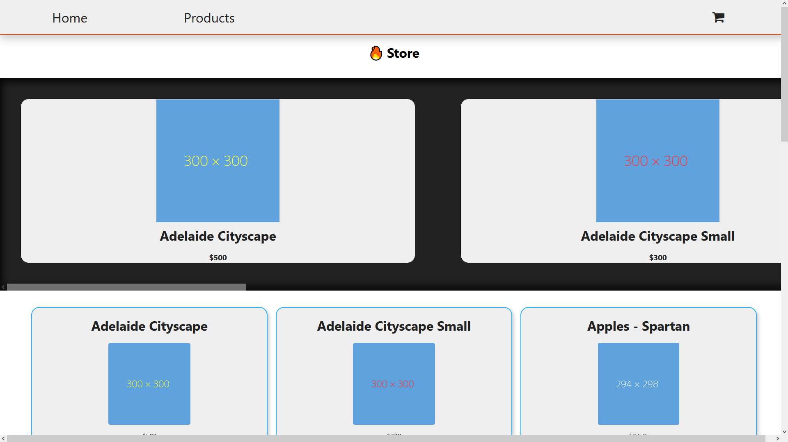

# React eStore

## Setup

You will require a Firebase API key for this project to work. By default the path of the firebase.json file is `/src/data/firebase.json`.

Clone the project.

`git clone https://github.com/Connor-Turlan/react-estore`

CD into the project root.

`cd react-estore`

Run:

`npm install`

Once installation is complete, you can run:

`npm start`

To begin the application.

## MVP

#### The below MVP is identical to the MVP for the original React eStore MVP.

At a minimum your e-shop website should have two pages:

-   Home Page
    -   This will contain:
        -   A Grid of products
        -   Carousel of featured products
        -   Product Page (with id parameter) Similar to a product page on another site, allows you to add to cart and select product variants
-   All products should be stored in Firestore:
    -   You should store the following information:
        -   quantity
        -   variants (could be colors, sizes, etc)
        -   price per unit
        -   name
        -   image url
        -   favourited or not (boolean)
            All data should be stored in Firestore and fetched by the frontend, there should be NO static product data in the react application

### Bonus

Using Firestore and react create, a cart system. Create a cart page in your react app Add logic to prevent users from adding items to cart that are no longer in stock. You will have to check the current cart and the product quantity Cart page should have the following:

-   List of products in cart

    -   Ability to change quantity of products in cart
    -   Ability to remove items from cart

## Goals

For this project I wanted to create an e-commerce store using react and firestore that could be reused for many difference websites with ease.

All products are required to be stored in the firestore database, in addition, if items change in the database they should update for the user as well.

## Known Issues

-   No currently known issues.

## Retrospective

I found this project difficult to begin with, as when I started I was inexperienced with React. The biggest challenge I faced was getting used to contexts, and how to use them in this application.

While it isn't commonly used by many products, my favorite feature to implement was the item variants. I found that to be a really simple but effective addition to the store that made the entire app feel real.

Coming back to this project, I would like to try and make use of more widely used components, such as a carousel from `better-react-carousel`.

Also, I didn't design this project with responsiveness in mind, so potentially adding support for mobiles and tablets in future would be beneficial.

## Future Plans

-   Implement touch and drag for carousel component, or `better-react-carousel`.
-   Add github secret to allow for a functional preview.
-   Add responsive styling.

## Similar Projects

[Google Books API - React](https://github.com/Connor-Turlan/google-books-react)

-   A front-end presentation of the Google Books API using the React.js library.

## License

No license required.

## Contributions

Made by Connor Turlan 2022.
